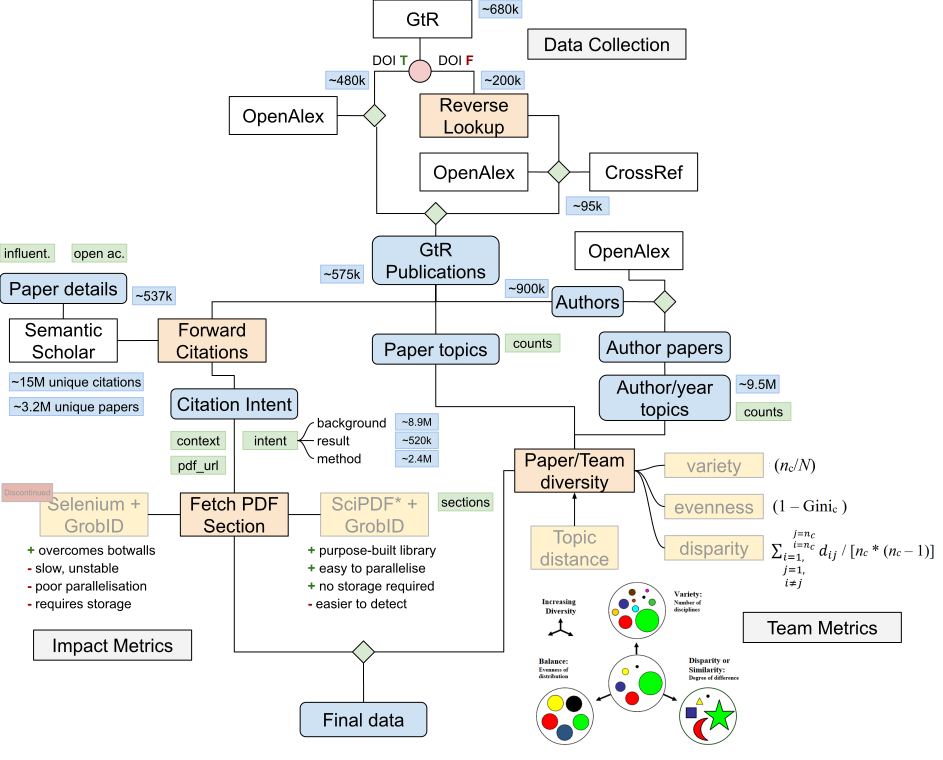

# Impact and Team Science Metrics for UKRI-Funded Research Publications

This project enhances the analysis of UKRI-funded research by linking publication data from the Gateway to Research (GtR) database to OpenAlex, even in the absence of DOIs. It enriches citation data with contextual information and evaluates the interdisciplinary nature of research teams.

<p align="center">
    
</p>

## Methodology

- **DOI labeling and dataset matching**: Utilises CrossRef and OpenAlex APIs to generate potential DOI matches using publication metadata, improving data coverage for subsequent analysis.

- **Citation intent and section identification**: Collects contextual citation information using Semantic Scholar’s API and categorises citations based on intent. This is complemented with data from open-access full-text publications tagged by OpenAlex or available through CORE.

- **Interdisciplinary metrics development**: Evaluates the interdisciplinary nature of research teams using methodologies from Leydesdorff, Wagner, and Bornmann (2019), including variety, balance, and disparity metrics. The Leiden CWTS topics taxonomy is used for discipline classification.

## Outcomes

- **Categorised dataset**: A detailed dataset linking GtR publications to OpenAlex, including predicted DOIs and enhanced with context and intent impact metrics.

- **Scalable and reusable code**: Python-written, user-friendly code following Open Source principles and Nesta’s guidelines.

- **Explanatory documentation**: An accessible notebook detailing methodologies, code functionalities, and troubleshooting tips.

- **Continuous collaboration**: Ongoing work with DSIT to ensure proper code transfer.

## Installation

1. **Clone the repository**:
   ```bash
   git clone https://github.com/innovation-growth-lab/dsit-impact.git
   cd dsit-impact
   ```

2. **Install the package**:
   ```bash
   pip install -e .
   ```

3. **Install required libraries**:
   ```bash
   pip install -r requirements.txt
   ```

4. **Set up `scipdf`**:
   - Install any [spaCy English language](https://spacy.io/usage) library.
   - Run an instance of `GROBID`. The recommended method is via its [Docker image](https://hub.docker.com/r/lfoppiano/grobid/). Refer to the `GROBID` [documentation](https://grobid.readthedocs.io/en/latest/Grobid-docker/) for setup instructions.

5. **Configure environment variables**:
   - Set up environment variables required for S3 file repositories. Refer to Kedro's [documentation](https://docs.kedro.org/en/stable/configuration/credentials.html) for creating a `credentials.yml` file.

## Getting Started

Execute the desired pipeline using the command:

```bash
kedro run --pipeline <pipeline_name>
```

Replace `<pipeline_name>` with the name of the pipeline you want to run (e.g., `data_collection_gtr`).

## Project Structure

The project is organised into several key directories and files, each serving a specific purpose within the Kedro framework:

- **Configuration directory (`conf/`)**:
  - Contains configuration files that define the parameters and settings used throughout the project.
  - Includes `logging.yml` for logging configuration, `credentials.yml` for accessing external services, and various parameter files for different data processing tasks.

- **Source code directory (`src/`)**:
  - Contains the core codebase of the project, organised into submodules corresponding to different stages of the data processing pipeline.
  - Includes pipelines for data collection from GtR, OpenAlex, and Semantic Scholar, as well as data processing for authors, PDFs, and team metrics analysis.

## Kedro Framework Context

The project leverages the [Kedro framework](https://docs.kedro.org/en/stable/) to create modular and reusable data pipelines. Each pipeline is responsible for a specific aspect of the project, such as data collection, processing, or analysis. Kedro's structure helps in organising the project, making it easy to extend and maintain.

The modular nature of Kedro pipelines allows for their integration into other codebases, even for users not familiar with Kedro. This flexibility enables the reuse of well-defined data processing components within different projects or workflows. Additionally, Kedro's [Data Catalog](https://docs.kedro.org/en/stable/data/index.html) provides a standardised interface for data input and output operations, supporting various file types and storage systems, which facilitates seamless integration with native I/O frameworks.

For more information, refer to the [Kedro documentation](https://docs.kedro.org/en/stable/).

## How the project ties to the code pipelines

Each aspect of the project is implemented through specific pipelines:

- **DOI Labeling and Dataset Matching**:
  - Pipelines: `data_collection_gtr`, `data_matching_oa`
  - Functions: Collecting GtR publication data, matching with OpenAlex entries, generating potential DOI matches using publication metadata.

- **Citation Intent and Section Identification**:
  - Pipelines: `data_collection_s2`, `data_processing_pdfs`
  - Functions: Collecting citation context data from Semantic Scholar, processing open-access full-text publications to identify citation sections and contexts.

- **Team Science Metrics**:
  - Pipelines: `data_processing_authors`, `data_analysis_team_metrics`
  - Functions: Processing author-related data, calculating interdisciplinary metrics for research teams.

- **Data Generation**:
  - Pipeline: `master_data_generation`
  - Functions: Integrating outputs from other pipelines, preparing final datasets for use by DSIT.

For more details, visit the [dsit-impact GitHub repository](https://github.com/innovation-growth-lab/dsit-impact). 